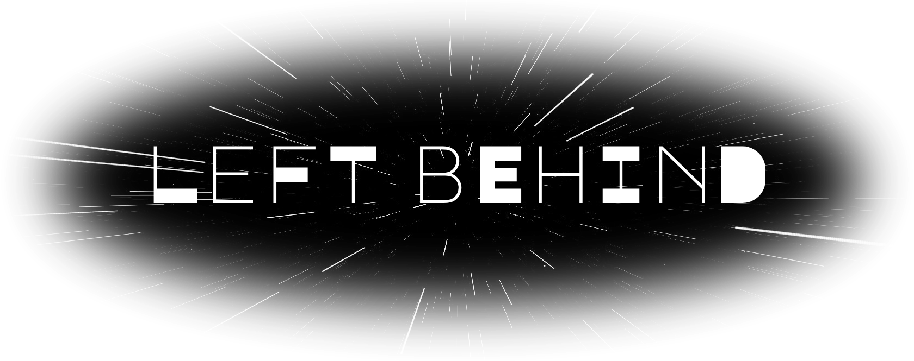
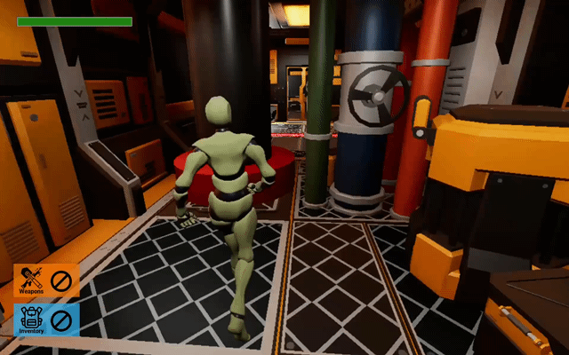
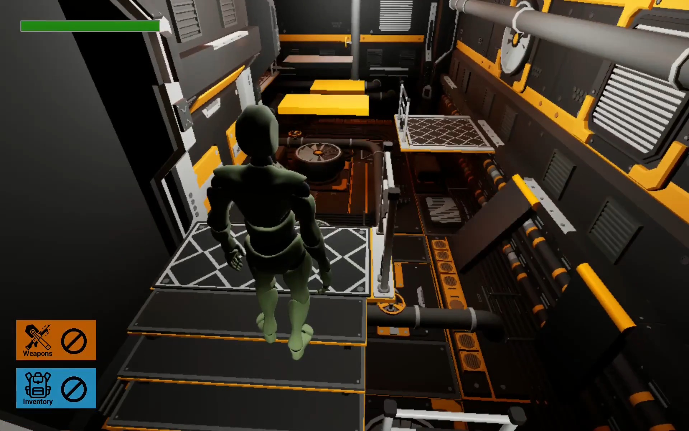
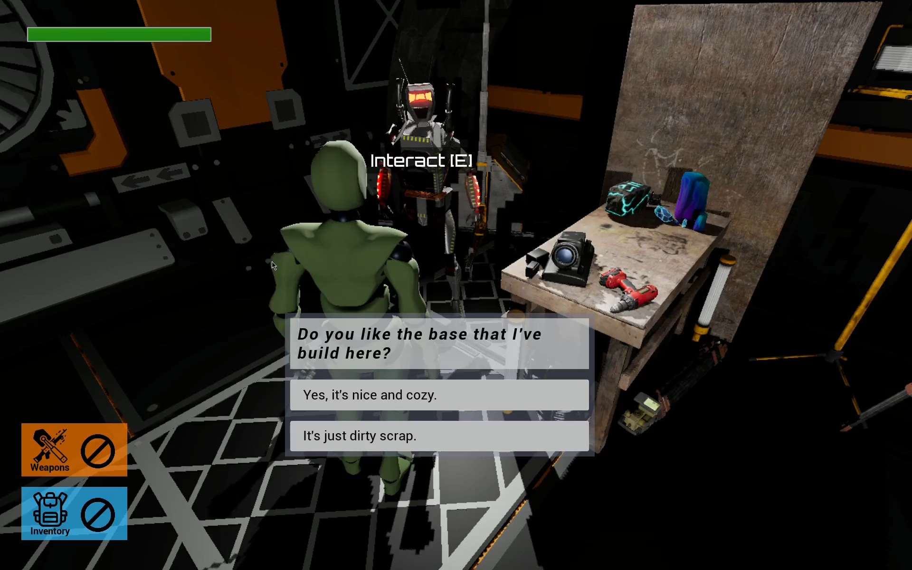
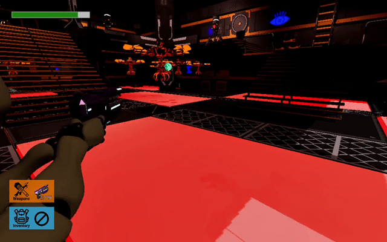

<!-- ```
LL      EEEEEE  FFFFFF  TTTTTT  
LL      EE      FF        TT    
LL      EEEEE   FFFFF     TT    
LL      EE      FF        TT    
LLLLLL  EEEEEE  FF        TT    

BBBBB   EEEEEE  HH  HH  IIIIII  NN    N  DDDD
BB  BB  EE      HH  HH    II    N N   N  DD  D
BBBBB   EEEEE   HHHHHH    II    N  N  N  DD  DD
BB  BB  EE      HH  HH    II    N   N N  DD  D
BBBBB   EEEEEE  HH  HH  IIIIII  N    NN  DDDD
``` -->

<div align="center">
    
</div>

Left Behind is a school project developed for the **Game Engines** course. It is a third-person game that combines shooter and platformer elements. The game was built in [Unreal Engine 5](https://www.unrealengine.com/unreal-engine-5) (specifically version 5.4) using Blueprints.


## Backstory and concept

The story takes place in a dystopian world where the Sun is completely obscured by a man-made megastructure: a Dyson sphere. Those humans who did not leave the solar system have long since perished. The only remaining inhabitants are robots living in an illusion of utopia.

The player - a robot - is torn from this utopian illusion by another robot. This ally grants the player "eyes" (cameras) and reveals the bitter reality of their world. Their only hope lies in interrupting the automated delivery of satellites to the Dyson sphere. However, even after ages of decay, human technology remains reliable, and the mining base is still protected by other robots.


## Game description

The game follows a robot attempting to stop rockets carrying satellites to the Dyson sphere. The setting is an asteroid where raw materials are mined and used for satellite production.

The game consists of two levels/maps featuring open exploration. During exploration, the player can find weapons, ammo, health kits, or keys required for progression.

On the path to the rocket, environments are filled with obstacles and traps that the player must overcome. Other areas are populated by hostile sentry robots guarding the rockets. Once the player fights through the guards and reaches a rocket, they must complete a minigame to successfully decommission it.

---

> ⚠️ For licensing reasons, this repository does not contain all the assets required to properly run the game. 


## Screenshots

<table border="0" cellpadding="0" cellspacing="0">
  <tr>
    <td></td>
    <td></td>
  </tr>
  <tr>
    <td></td>
    <td></td>
  </tr>
</table>